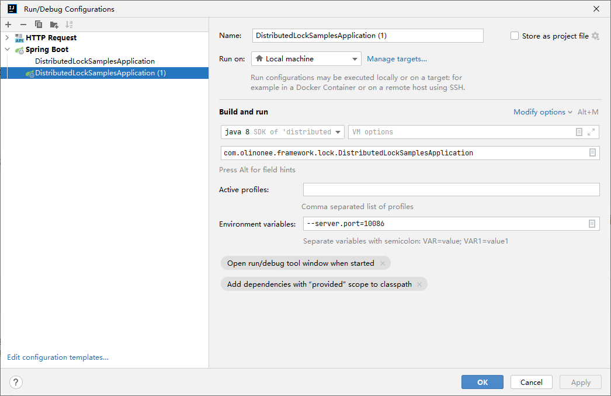

# distributed-lock-samples-ING

#### 介绍
这是一个分布式锁学习的案例。

#### 软件架构
软件架构说明
```text
├─doc                                   # 相关文档说明
│  ├─assets                             # 截图
│  └─script                             # SQL脚本
└─src                                   # 源码
  ├─main
  │  ├─java
  │  │  └─com
  │  │      └─olinonee
  │  │          └─framework
  │  │              └─lock
  │  │                  ├─config       # 配置类
  │  │                  ├─controller   # 控制器
  │  │                  ├─entity       # 实体类
  │  │                  ├─mapper       # 数据访问层
  │  │                  └─service      # 业务类
  │  │                      └─impl
  │  └─resources                       # 资源目录
  │      ├─static                      # 静态资源
  │      └─templates                   # 模板资源
  └─test                               # 测试类
      └─java
          └─com
              └─olinonee
                  └─framework
                      └─lock
```

#### 相关文档说明

1. [事务隔离级别](doc/事务隔离级别.md)
2. [分布式锁](doc/分布式锁.md)
3. [并发测试对比结果](doc/并发测试对比结果.md)
4. [JVM死锁](doc/死锁.md)

#### 使用说明

1. **单例模式**
```java
public class StockController {
    // 取消注释，进行测试
    private ISinglePatternStockService stockService; // 单例
    
    // ...
}
```

2. **多例模式**
```java
public class StockController {
    // 取消注释，进行测试
    private IPrototypePatternStockService stockService; // 多例
    
    // ...
}
```

3. **单例 + 事务**
```java
public class StockController {
    // 取消注释，进行测试
    private ITransactionalStockService transactionalStockService; // 事务
    
    // ...
}
```

4. **集群**
使用均衡负载，nginx.conf配置内容如下：
```text
worker_processes  1;

events {
    worker_connections  1024;
}


http {
    include       mime.types;
    default_type  application/octet-stream;

    sendfile        on;
    keepalive_timeout  65;
	
    # 负载均衡
    upstream distributedLockSample {
        server localhost:10010;
        server localhost:10086;
    }

    server {
        listen       80;
        server_name  localhost;

        # 反向代理
        location / {
            proxy_pass http://distributedLockSample;
        }
    }
}
```
为了测试集群，使用idea开2个不同的实例，配置实例截图如下：



环境变量设置如下：
```text
--server.port=10086
```
