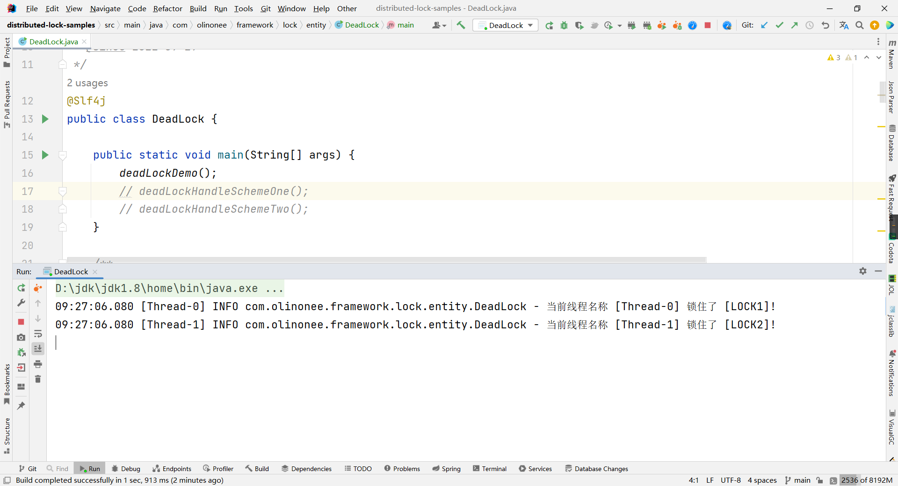
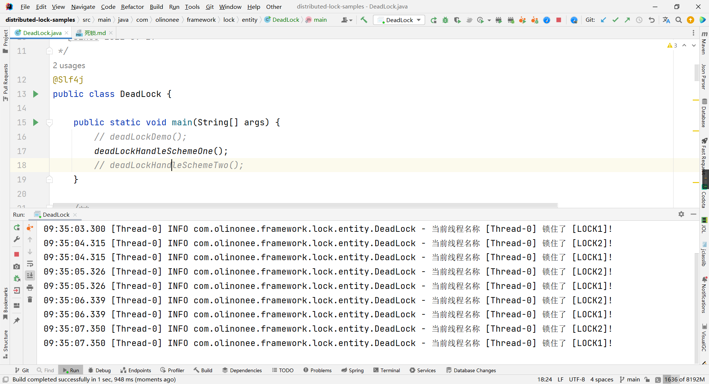

## 死锁
### 死锁是什么？
**死锁**是**指两个或两个以上的进程**在执行过程中，**由于竞争资源或者由于彼此通信而造成的一种阻塞的现象**，若无外力作用，它们都将无法推进下去。此时称系统处于死锁状态或系统产生了死锁，这些永远在**互相等待的进程称为死锁进程**。产生死锁的原因，主要包括：
- 系统资源不足；
- 程序执行的顺序有问题；
- 资源分配不当等。

如果系统资源充足，进程的资源请求都能够得到满足，那么死锁出现的可能性就很低；否则，就会因争夺有限的资源而陷入死锁。其次，程序执行的顺序与速度不同，也可能产生死锁。

产生死锁的四个必要条件：
- 互斥条件：一个资源每次只能被一个进程使用。
- 请求与保持条件：一个进程因请求资源而阻塞时，对已获得的资源保持不放。
- 不剥夺条件：进程已获得的资源，在末使用完之前，不能强行剥夺。
- 循环等待条件：若干进程之间形成一种头尾相接的循环等待资源关系。

这四个条件是死锁的必要条件，只要系统发生死锁，这些条件必然成立，而只要上述条件之一不满足，就不会发生死锁。

### 死锁代码
如下是一段经典的死锁代码，具体代码参考 `com.olinonee.framework.lock.entity.DeadLock` 代码，代码如下：

```java
@Slf4j
public class DeadLock {

    public static void main(String[] args) {
        deadLockDemo();
    }

    /**
     * 创建死锁
     *
     * @param firstLock  第一把锁
     * @param secondLock 第二把锁
     * @return Thread类
     */
    private static Thread createDeadLock(String firstLock, String secondLock) {
        return new Thread(() -> {
            try {
                while (true) {
                    synchronized (firstLock) {
                        log.info("当前线程名称 [{}] 锁住了 [{}]!", Thread.currentThread().getName(), firstLock);
                        Thread.sleep(1000);
                        synchronized (secondLock) {
                            log.info("当前线程名称 [{}] 锁住了 [{}]!", Thread.currentThread().getName(), secondLock);
                        }
                    }
                }
            } catch (Exception e) {
                e.printStackTrace();
            }
        });
    }

    /**
     * 死锁示例：
     * <pre>
     * 启动了两个线程，在每个线程中都要获得 LOCK_1 和 LOCK_2，其中
     * thread_1，先获取 LOCK_1，再获取 LOCK_2；
     * thread_2，先获取 LOCK_2，再获取 LOCK_1；
     * 这样，当 thread_1 获取到 LOCK_1 之后，就要去获取 LOCK_2，而 LOCK_2 则是先被 thread_2 获取了，因此 thread_1 就需要等待 thread_2 释放 LOCK_2 之后才能继续执行；
     * 但是 thread_2 在获取到 LOCK_2 之后，却是在等待 thread_1 释放 LOCK_1，因此这就形成了“循环等待条件”，从而形成了死锁。
     * </pre>
     */
    private static void deadLockDemo() {
        // 锁标志
        final String LOCK_1 = "LOCK1";
        final String LOCK_2 = "LOCK2";

        Thread thread_1 = createDeadLock(LOCK_1, LOCK_2);
        Thread thread_2 = createDeadLock(LOCK_2, LOCK_1);

        thread_1.start();
        thread_2.start();
    }
}
```
代码效果：

按照加锁顺序打印完 2 次输出结果之后，注意这里是 2 个不同的线程 **Thread-0** 和 **Thread-1**，控制台处于阻塞状态，如下图所示：



**说明：**

启动了两个线程，在每个线程中都要获得 `LOCK_1` 和 `LOCK_2`，其中
`thread_1`，先获取 `LOCK_1`，再获取 `LOCK_2`；
`thread_2`，先获取 `LOCK_2`，再获取 `LOCK_1`；
这样，当 `thread_1` 获取到 `LOCK_1` 之后，就要去获取 `LOCK_2`，而 `LOCK_2` 则是先被 `thread_2` 获取了，因此 `thread_1` 就需要等待 `thread_2` 释放 `LOCK_2` 之后才能继续执行；
但是 `thread_2` 在获取到 `LOCK_2` 之后，却是在等待 `thread_1` 释放 `LOCK_1`，因此这就形成了“**循环等待条件**”，从而形成了死锁。

### 死锁代码解决方案
这里主要提供了上述经典死锁代码的2种解决方案，具体代码参考 `com.olinonee.framework.lock.entity.DeadLock` 代码，代码如下：

1. 对多个资源加锁时，要保持加锁的顺序一致
```java
@Slf4j
public class DeadLock {

    public static void main(String[] args) {
        deadLockHandleSchemeOne();
    }

    /**
     * 创建死锁
     *
     * @param firstLock  第一把锁
     * @param secondLock 第二把锁
     * @return Thread类
     */
    private static Thread createDeadLock(String firstLock, String secondLock) {
        return new Thread(() -> {
            try {
                while (true) {
                    synchronized (firstLock) {
                        log.info("当前线程名称 [{}] 锁住了 [{}]!", Thread.currentThread().getName(), firstLock);
                        Thread.sleep(1000);
                        synchronized (secondLock) {
                            log.info("当前线程名称 [{}] 锁住了 [{}]!", Thread.currentThread().getName(), secondLock);
                        }
                    }
                }
            } catch (Exception e) {
                e.printStackTrace();
            }
        });
    }

    

    /**
     * 死锁处理方案1：
     * <pre>
     * 想要解决这个死锁很简单，我们只需要让 thread_1 和 thread_2 获取 LOCK_1 和 LOCK_2 的顺序相同即可，即对多个资源加锁时，要保持加锁的顺序一致
     * </pre>
     */
    private static void deadLockHandleSchemeOne() {
        // 锁标志
        final String LOCK_1 = "LOCK1";
        final String LOCK_2 = "LOCK2";

        Thread thread_1 = createDeadLock(LOCK_1, LOCK_2);
        Thread thread_2 = createDeadLock(LOCK_1, LOCK_2);

        thread_1.start();
        thread_2.start();
    }
}
```
代码效果：

控制台循环输出信息，使用的是同一个线程输出，即 **Thread-0**，并且未处于阻塞状态，如下图所示：



**说明：**

想要解决这个死锁很简单，我们只需要让 `thread_1` 和 `thread_2` 获取 `LOCK_1` 和 `LOCK_2` 的顺序相同即可，即**对多个资源加锁时，要保持加锁的顺序一致**。

2. 使用同一把锁，使用字符串作为锁对象创建2把相同的字符串锁，由于字符串常量池，认为是同一把锁
```java
@Slf4j
public class DeadLock {

    public static void main(String[] args) {
        deadLockHandleSchemeTwo();
    }

    /**
     * 创建死锁
     *
     * @param firstLock  第一把锁
     * @param secondLock 第二把锁
     * @return Thread类
     */
    private static Thread createDeadLock(String firstLock, String secondLock) {
        return new Thread(() -> {
            try {
                while (true) {
                    synchronized (firstLock) {
                        log.info("当前线程名称 [{}] 锁住了 [{}]!", Thread.currentThread().getName(), firstLock);
                        Thread.sleep(1000);
                        synchronized (secondLock) {
                            log.info("当前线程名称 [{}] 锁住了 [{}]!", Thread.currentThread().getName(), secondLock);
                        }
                    }
                }
            } catch (Exception e) {
                e.printStackTrace();
            }
        });
    }
    
    /**
     * 死锁处理方案2：
     * <pre>
     * 除此之外，还有一种解决方法，那就是让 LOCK_1 和 LOCK_2 的值相同，这是为什么呢？因为字符串有一个常量池，如果不同的线程持有的锁是具有相同字符的字符串锁时，那么两个锁实际上就是同一个锁。
     * </pre>
     */
    private static void deadLockHandleSchemeTwo() {
        // 锁标志
        final String LOCK_1 = "LOCK";
        final String LOCK_2 = "LOCK";

        Thread thread_1 = createDeadLock(LOCK_1, LOCK_2);
        Thread thread_2 = createDeadLock(LOCK_2, LOCK_1);

        thread_1.start();
        thread_2.start();
    }
}
```
代码效果：

同样地，控制台循环输出信息，使用的是同一个线程输出，即 **Thread-0**，并且未处于阻塞状态，如下图所示：


**说明：**

除此之外，还有一种解决方法，那就是让 `LOCK_1` 和 `LOCK_2` 的值相同，这是为什么呢？**因为字符串有一个常量池，如果不同的线程持有的锁是具有相同字符的字符串锁时，那么两个锁实际上就是同一个锁。**

### 参考
[https://cloud.tencent.com/developer/article/1628870](https://cloud.tencent.com/developer/article/1628870)

